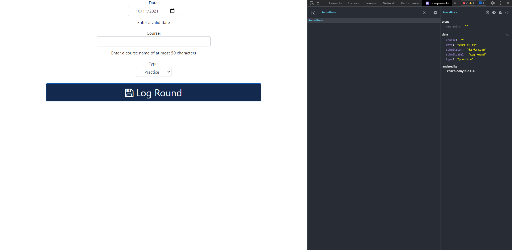
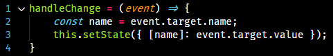
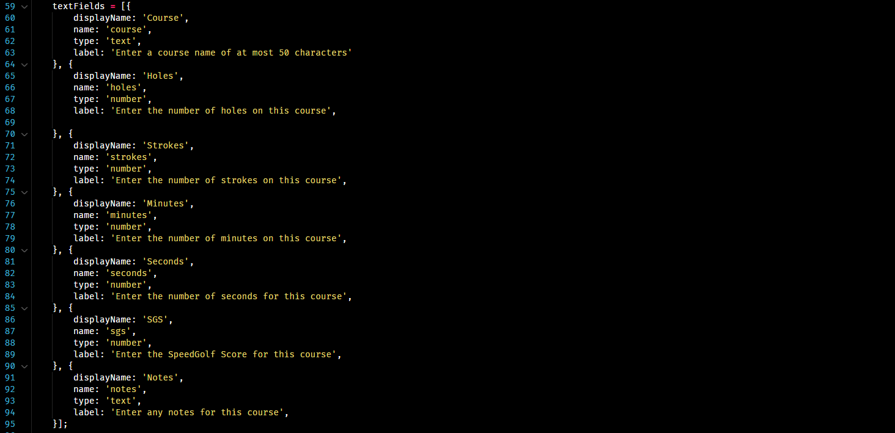
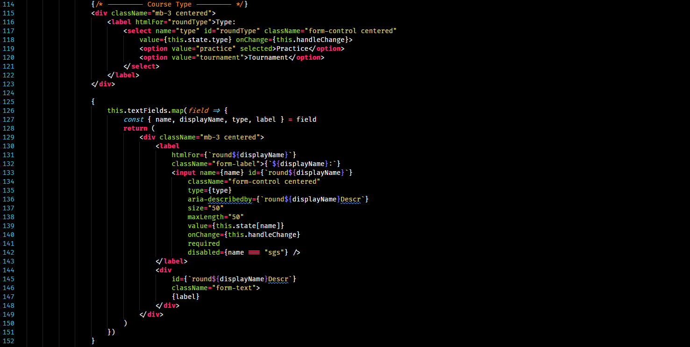
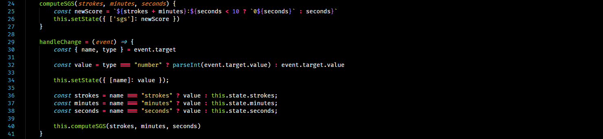
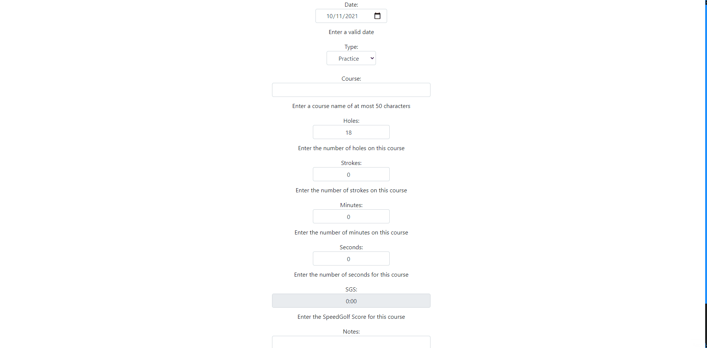

### Exercise 3:
The whole point of React is so your app can maintain state. Thus, having a form component that maintains form state that is mad of up of html form elements that also maintain state has the capacity to get confusing and cause problems. Thus, in React's words, it's best to only use one. On their website [here](https://reactjs.org/docs/forms.html), they say 

> We can combine the two by making the React state be the “single source of truth”. Then the React component that renders a form also controls what happens in that form on subsequent user input. An input form element whose value is controlled by React in this way is called a “controlled component”.

### Exercise 6:

Here we see the react dom on the left and component info on the right. Since we only have one react component, our dom tree only has one item.

### Exercise 7:

We have a state object that maintains our component state. That object has a key on it called `name`. Whenever we call `setState`, the component will rerender.

Line 3 will call `setState` and change just the `name` key of the state object and store the value of the html form element in it.

### Programming Task 1:
For the first task, I changed two things:

1. I added an array of objects for the text fields:

2. And then I swapped the Course type and the course name fields so I could map out all the textfields at once:

This made it easier to read and does the same thing as before. 

For the second task, I changed the `handleChange` function and added the `computeSGS` functions like this:

And here it is at work:
